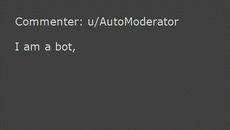

# (Semi-)Automated Reddit Video Tool

A Python program that takes text input and can generate the sentence-by-sentence reading and text-to-speech stuff that's common in Reddit reading videos.

It's not fully automated, but at least it's simple. This program is not designed to be fully automated because that allows a person to add a special flare to the video. (The videos that add practically nothing are so boring, but hey, quantity over quality for these things. Go make your own tool if you want that.)

In the future, I may make a version which can actually read from a web page to generate the images. (But that's super complicated so don't wait anxiously.)

## Getting Started

There are quite a few programs needed to properly do something like this. At the very least:

* a text-to-speech program, because that's the point of Reddit readings
* an image editor/manipulator, to turn text into an image
* a program to convert the image and audio into a video
* a video editor, to put the audio and video/images together (this part is manual)

For this project, I just used whatever free and good stuff existed. Since the source code is here, you should be able to swap out a requirement pretty easily, if you know what you're doing. I used:

* [Balabolka](http://balabolka.site/balabolka.htm) (command line version) for text-to-speech (I couldn't figure out how to make [eSpeak](https://espeak.sourceforge.net/) use Daniel UK through the command line)
* [ImageMagick](https://imagemagick.org/) for image creation (*way* easier than learning [GIMP](https://www.gimp.org/) scripting)
* [FFmpeg](https://ffmpeg.org/) for merging an image and an audio file into a video file (good luck finding good alternatives to this)
* [Kdenlive](https://kdenlive.org/en/) for video editing (why are there so few good free video editors)

### Prerequisites

* Python 3
* Windows, since I couldn't figure out how to add Daniel UK to eSpeak
    * of course, since the source code is here, it's not hard to change some things to make it work on Linux (and if you got Daniel UK working, tell me how)

### Installation

* download this repository
* download [Balabolka command line utility](http://balabolka.site/bconsole.htm), **then place the executable in the root folder**
* install [ImageMagick](https://imagemagick.org/script/download.php) (the full thing, so it will get added to PATH and usable by a command line)
* download [FFmpeg](https://www.gyan.dev/ffmpeg/builds/), **then place the executable in the root folder**
* Linux: probably `sudo apt install espeak`, `imagemagick`, and `ffmpeg`, and change some Python code
* get a video editor

If you're not a developer:

* download the "full" release in the [Releases page on GitHub](https://github.com/tanksdude/automated-reddit-video-tool/releases)
* install [ImageMagick](https://imagemagick.org/script/download.php)
* get a video editor, such as [Kdenlive](https://kdenlive.org/en/download/), and learn how to do basic things in it
    * (Optional) install [AutoHotkey (v1.1)](https://www.autohotkey.com/) to use the provided AHK script with Kdenlive
* be prepared to use the command line a little

## Running

Steps:

0. install the programs listed above (or change the script as you need)
1. Obtain the comment you wish to be read aloud. Paste it into a text file.
2. (Non-developer step) Open the command line and `cd` to where you placed this project. For example, `cd C:/Users/<name>/Desktop/automated-reddit-video-tool`.
3. Split the comment by sentences: `python comment_splitter.py <comment input file> <line-by-line output name>` (non-developers: run this through the command line)
4. (Optional) Manually edit the output file to adjust anything you want. For example, extra pauses when reading a comma-separated list or splitting after emojis.
5. (Optional) Generate a test image of the full comment, so you can change the font size and image size and stuff: `python comment_test_image.py <line-by-line input file> <png file output name>`
6. Take that output and have it read aloud: `python comment_to_speech.py <line-by-line input file> <mp4 file names>` (have a "$" in the MP4 name, because that's where the numbers will go)
7. Note: To edit the parameters of the final output, you will need to edit the constants at the top of `comment_to_speech.py`. The font is Verdana because that's what Reddit uses.
8. Throw the MP4 files into your favorite video editor and do what you want!
9. (Optional) There's an AutoHotkey script included with this project (`kdenlive_size_adjustment.ahk`) to speed up editing in Kdenlive, since Kdenlive scales the video and I didn't want that.

There are ways to further automate this process but that's beyond the scope of this project.

If you get the error `'python' is not recognized as an internal or external command, operable program or batch file.`, this means you haven't added Python to PATH. The easiest fix would be to reinstall Python and check "Add Python to PATH" at the start of the installation. Another solution is to [manually do that yourself](https://www.geeksforgeeks.org/how-to-add-python-to-windows-path/). The least-intrustive option is to change all `python` commands into `py -3`.

### Bonus

#### Want the words to be censored? No problem!

Make a file in the form `bad1|censored1 bad2|censored2 bad3|censored3 ...` (but replace spaces with newlines), and keep in mind that the word replacement is case-sensitive.

Then `python comment_splitter.py [input comment file] [split comment file] -c [censored words file]`

#### Want the words spoken to be slightly different than the text that appears (since sometimes the text-to-speech voices introduce pauses where most people wouldn't pause)? No problem!

`python comment_to_speech.py [line-by-line speech text input file] [mp4 file names] -t [line-by-line image text input file]`

#### Want to replace just one mis-formatted video? No problem!

`python comment_to_speech.py [rest of args] -n [video number]`

(This doesn't update later videos that depend on this one; should only use this option if you're only using the audio from the videos and need to replace just one.)

### Known Emoji Problem

Emojis don't render with full color. Likely an issue about rendering them as raw Unicode characters or something, I dunno. Happens because ImageMagick is fed Markdown text, proper solution is to use a browser or something (but that's complicated).

### `Odd character â?obâ??, expected a â?o=â?? after attribute name â?omeâ?? of element â?o---â??`

ImageMagick's Pango renderer (used to render text in this project) has non-typical markup syntax, looking like HTML ([apparently it's "standard", but Markdown ended up being far more popular so it feels wrong](https://en.wikipedia.org/wiki/Standard_Generalized_Markup_Language)). Instead of \**doing this*\* for italic, you do <i>*this*</i>. [Here's the full syntax list (through the Wayback Machine)](https://web.archive.org/web/20210514023116/https://developer.gnome.org/pygtk/stable/pango-markup-language.html). As such, if you have a `<` or `>` character, Pango will think it's the start of some markup. To fix, replace those characters with `&lt;` and `&gt;` (and replace other `&` with `&amp;`). This is not done automatically because the speech file uses plain text, and markup is not plain text.

### Video codec note

The video codec is set to H.264, because that's been the standard for a long time. As of writing this, the industry is *slowly* moving towards AV1. You will need to update the script a little if you want to use the AV1 codec (just change one string at the top of `comment_to_speech.py`).

### Audio codec note

The audio codec is set to AAC, because that's been the standard for a long time. At least to me, there has been very little industry movement pushing for Opus, probably because video takes up **far** more space than audio, despite Opus being around for far longer than AV1 (though they seriously have an awareness problem, since I only found out about Opus when one day randomly searching for what other audio codecs exist). Most sites that support AV1 support Opus. You will need to update the script a little if you want to use the Opus codec (just change one string at the top of `comment_to_speech.py`).

### Known Usability Problem

Kdenlive automatically scales clips to the project's profile settings. Although it keeps the aspect ratio, it's still not preferable.

I got around this issue by making an AutoHotkey script to drag a Transform effect and update all the values necessary (`kdenlive_size_adjustment.ahk`). I later found out you only need to correct one Transform effect, then drag it onto the other necessary clips, instead of dragging a Transform effect onto all of them and separately updating them all.

Alternatively, you could scale the image so you don't even need a background, but that makes a less interesting viewing experience. (Although the image could be transparent, the video can't be (for H.264 video; some encoders support alpha channels, and you can [check FFmpeg individual encoder support](https://stackoverflow.com/questions/61355521/how-can-i-create-a-transparent-video-from-transparent-images/61358177#61358177); seems like [FFV1 and qtrle](https://superuser.com/questions/1505679/lossless-video-codec-supporting-alpha-channels/1505695#1505695) are the main ones).)

## Example usage

Input comment:

```
Lorem ipsum dolor sit amet, consectetur adipiscing elit, sed do eiusmod tempor incididunt ut labore et dolore magna aliqua. Amet porttitor eget dolor morbi non arcu risus quis. Nibh tellus molestie nunc non blandit massa enim nec.
```

Split comment with `comment_splitter.py` (edited to also split on commas):

```
Lorem ipsum dolor sit amet, 
consectetur adipiscing elit, 
sed do eiusmod tempor incididunt ut labore et dolore magna aliqua. 
Amet porttitor eget dolor morbi non arcu risus quis. 
Nibh tellus molestie nunc non blandit massa enim nec.
```

Text-to-video with `comment_to_speech.py` (then converted to a GIF, but trust me, there would be audio if GIFs supported audio)


Remember to adjust video settings as needed.

Note: emojis don't render with full color.


It's a good idea to cite your sources. To do this, add `Poster: u/AutoModerator` or whatever to the top of the comment file, then simply don't include the first video file when making the video! Yes, it's a hack, but it's a simple solution.



## Contributing

This is intended to be an extremely simple way to automate the worst parts of Reddit readings (line-by-line advancement), so once it's done it's done.

If you want to do something with this project, the source code is right here.

## Versioning

1.0.0 is "done," and I dunno if I'll update it after that.

## License

This project is licensed under the GNU General Public License v3.0

## Acknowledgments

* Reddit readings
* myself for making me use Python to do something more "code-y" for once
* StackOverflow
